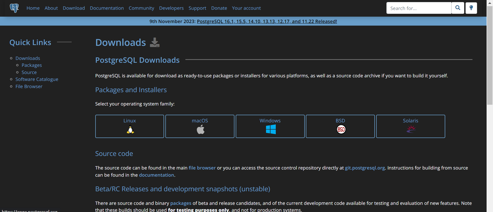

# Installation and Configuration of PostgresSQL and MySQL Server, and Implementing 3NF Design with several ERD(Entity Relation Diagram's)

Download postgres using the link [Postgres](https://www.postgresql.org/download/)



Ensure to add the directory of the postgres from your file explorer if you are using windows to your system path, so you could run postgres commands and SQL commands from your command line or terminal.
After your installation, configure postgres to work, by creating your username and password during the installation process.
Main Steps:
1.	Open your terminal or command line if you are using windows.
    
    

2.	Check which username is current logged in postgres, but first use the command below to log in to postgres. 
`psql -U postgres -h localhost`

Insert your password the one you created during the installation.
 

 Find out the user logged in using this command `SELECT usename FROM pg_user;`
 

3.	 Create a database using the command `CREATE DATABASE Design1;` and on next shell line `SELECT datname FROM pg_database;` follow the picture below.
 
4.	 To check in to the database you just created use  `\c design1` follow the picture below.
 
5.	To  create the tables using the SQL schema follow the scripts below.

To create the Customers Table.


-- Create Customers table
```sql

CREATE TABLE Customers (
    customer_id SERIAL PRIMARY KEY,
    customer_sname VARCHAR(50),
    first_name VARCHAR(50),
    email VARCHAR(100),
    phone_number VARCHAR(20),
    address VARCHAR(255),
    registration_date DATE
);

-- Create Product table
```sql

CREATE TABLE Product (
    product_id SERIAL PRIMARY KEY,
    product_name VARCHAR(100),
    description TEXT,
    price NUMERIC,
    manufacturer VARCHAR(50),
    production_date DATE,
    expiration_date DATE
);

-- Create Transactions table
```sql

CREATE TABLE Transactions (
    transaction_id SERIAL PRIMARY KEY,
    customer_id INT REFERENCES Customers(customer_id),
    transaction_date DATE
);

-- To create the ProductTransactions Table.

-- Create ProductTransactions table
```sql
CREATE TABLE ProductTransactions (
    product_transaction_id SERIAL PRIMARY KEY,
    customer_id INT REFERENCES Customers(customer_id),
    product_id INT REFERENCES Product(product_id),
    quantity INT,
    total_price NUMERIC,
    transaction_id INT REFERENCES Transactions(transaction_id),
    transaction_date DATE
);`

--To create the Warehouse Table.

-- Create Warehouse table

```sql

CREATE TABLE Warehouse (
    warehouse_id SERIAL PRIMARY KEY,
    product_id INT REFERENCES Product(product_id),
    quantity INT,
    received_date DATE,
    expiration_date DATE,
    transaction_id INT,
    CONSTRAINT fk_product_id
        FOREIGN KEY (product_id)
        REFERENCES Product(product_id),
    CONSTRAINT fk_transaction_id
        FOREIGN KEY (transaction_id)
        REFERENCES Transactions(transaction_id)
);`

-- Add Index on product_id and transaction_id for optimization
```sql
CREATE INDEX idx_warehouse_product_transaction
ON Warehouse (product_id, transaction_id);

-- To create the store Table.

-- Create Store table

```sql

CREATE TABLE Store (
    store_id SERIAL PRIMARY KEY,
    customer_id INT REFERENCES Customers(customer_id),
    product_id INT REFERENCES Product(product_id),
    transaction_id INT REFERENCES Transactions(transaction_id),
    warehouse_id INT REFERENCES Warehouse(warehouse_id),
    quantity INT,
    total_price NUMERIC,
    sale_date DATE
);

-- Add Index on product_id, transaction_id, and warehouse_id for optimization
```sql
CREATE INDEX idx_store_product_transaction_warehouse
ON Store (product_id, transaction_id, warehouse_id);


